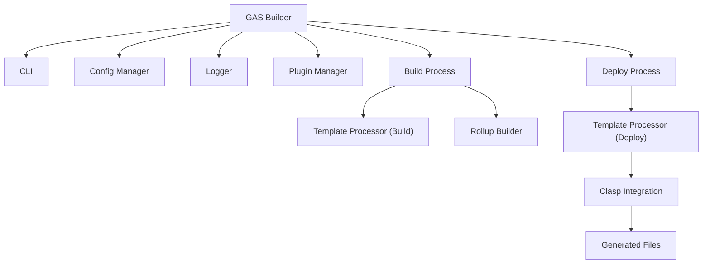
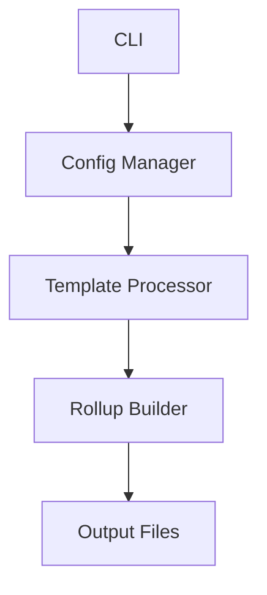
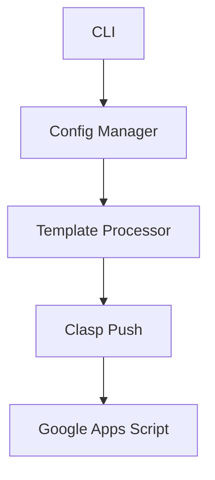

# Arquitetura do GAS Builder

> Última atualização: 08/05/2025

## Resumo

Este documento descreve a arquitetura técnica do sistema GAS Builder, detalhado como um sistema JavaScript que suporta projetos em JavaScript ou TypeScript. São apresentados seus componentes principais, fluxo de dados e interações entre módulos. É destinado a desenvolvedores que precisam compreender a estrutura interna do sistema para manutenção, extensão ou integração.

## Visão Geral da Arquitetura

O GAS Builder é um sistema modular implementado em JavaScript que transforma código (JavaScript ou TypeScript) em Google Apps Script através de um pipeline de processamento bem definido. A arquitetura foi projetada com os seguintes princípios:

- **Modularidade**: Componentes com responsabilidades únicas e bem definidas
- **Extensibilidade**: Sistema de plugins para adicionar funcionalidades
- **Configurabilidade**: Configuração centralizada e flexível
- **Compatibilidade**: Foco na compatibilidade com o ecossistema Google Apps Script

### Diagrama de Componentes



## Componentes Principais

### 1. CLI (Command Line Interface)

**Responsabilidade**: Interface de linha de comando para interação com o sistema.

**Características**:

- Implementada com o pacote `yargs` para parsing de argumentos
- Comandos principais: build, deploy, watch
- Opções configuráveis por linha de comando
- Passagem de parâmetros para os componentes internos

**Módulos Principais**:

- `src/cli/index.ts`: Ponto de entrada da CLI
- `src/cli/commands/*.ts`: Implementações dos comandos

### 2. Config Manager

**Responsabilidade**: Gerenciamento de configuração do sistema.

**Características**:

- Carregamento de configuração YAML
- Validação contra schema JSON
- Mesclagem de configurações (defaults → projeto → ambiente)
- Acesso centralizado às configurações

**Módulos Principais**:

- `src/config/config.ts`: Carregamento e validação
- `src/config/schema.ts`: Definição do schema
- `schema/config.schema.json`: Schema JSON para validação

### 3. Logger

**Responsabilidade**: Sistema de logging uniforme.

**Características**:

- Níveis de log configuráveis (NONE, ERROR, WARN, INFO, DEBUG)
- Formatação colorida para console
- Filtragem de mensagens por nível
- Interface consistente em todo o sistema

**Módulos Principais**:

- `src/logger/logger.ts`: Implementação do logger

### 4. Plugin Manager

**Responsabilidade**: Gerenciamento de plugins para extensibilidade.

**Características**:

- Carregamento dinâmico de plugins
- Sistema de hooks para pontos de extensão
- Execução sequencial de plugins
- Interface consistente para desenvolvedores

**Módulos Principais**:

- `src/plugins/manager.ts`: Gerenciador de plugins
- `src/plugins/types.ts`: Definição de interfaces
- `plugins/*.ts`: Plugins padrão

### 5. Template Processor

**Responsabilidade**: Processamento de templates para arquivos de configuração.

**Características**:

- Baseado em Handlebars para substituição de variáveis
- Suporte a helpers personalizados
- Geração de arquivos de configuração (.clasp.json, appsscript.json, etc.)
- Variáveis contextuais baseadas no ambiente

**Módulos Principais**:

- `src/templates/processor.ts`: Processamento de templates
- `templates/*.json`: Templates padrão

### 6. Rollup Builder

**Responsabilidade**: Compilação e empacotamento de código TypeScript.

**Características**:

- Configuração dinâmica do Rollup
- Suporte a plugins configuráveis
- Transformação de TypeScript para JavaScript
- Empacotamento de módulos para formato compatível com GAS

**Módulos Principais**:

- `src/rollup/config.ts`: Configuração do Rollup
- `src/rollup/build.ts`: Processo de build
- `src/rollup/watch.ts`: Modo watch para desenvolvimento

### 7. Clasp Integration

**Responsabilidade**: Integração com o Google Clasp para deploy.

**Características**:

- Execução do Clasp para push de código
- Suporte a múltiplos ambientes (dev, prod)
- Configuração dinâmica do Clasp
- Validação pré-deploy

**Módulos Principais**:

- `src/deploy/deploy.ts`: Processo de deploy
- `src/deploy/clasp.ts`: Integração com Clasp

## Fluxos de Execução

### 1. Fluxo de Build

1. CLI recebe comando de build
2. Carregamento da configuração YAML
3. Validação da configuração
4. Execução de hooks de plugin `beforeBuild`
5. Processamento de templates
6. Geração de configuração do Rollup
7. Compilação com Rollup
8. Execução de hooks de plugin `afterBuild`
9. Retorno do resultado



### 2. Fluxo de Deploy

1. CLI recebe comando de deploy
2. Carregamento da configuração YAML
3. Validação da configuração
4. Execução de hooks de plugin `beforeDeploy`
5. Processamento de templates específicos do ambiente
6. Execução do Clasp para push do código
7. Execução de hooks de plugin `afterDeploy`
8. Retorno do resultado



## Interações entre Componentes

### Config Manager e Outros Componentes

O Config Manager é central para todo o sistema, fornecendo configurações para:

- **Template Processor**: Definições de templates e variáveis de substituição
- **Rollup Builder**: Configurações de build, plugins e entrypoints
- **Deploy Process**: Script IDs e configurações de ambiente
- **Logger**: Nível de log e configurações de formatação
- **Plugin Manager**: Caminhos e configurações de plugins

### Plugin Manager e Pontos de Extensão

O Plugin Manager permite estender o sistema em pontos-chave:

- **beforeBuild**: Executado antes do processo de build
- **afterBuild**: Executado após o processo de build
- **beforeDeploy**: Executado antes do processo de deploy
- **afterDeploy**: Executado após o processo de deploy

### Template Processor e Arquivos Gerados

O Template Processor gera arquivos essenciais para o funcionamento do sistema:

- **.clasp.json**: Configuração do Clasp para deploy
- **.claspignore**: Arquivos a serem ignorados no deploy
- **appsscript.json**: Manifesto do Google Apps Script
- **Arquivos personalizados**: Outros arquivos configuráveis

## Extensibilidade

### Sistema de Plugins

O sistema de plugins permite adicionar funcionalidades sem modificar o código core:

```typescript
// Exemplo de plugin personalizado
const meuPlugin = {
  name: 'MeuPlugin',
  hooks: {
    beforeBuild: async (config, projectKey) => {
      // Executado antes do build
      console.log(`Iniciando build para ${projectKey}`);
    },
    afterBuild: async (config, projectKey, outputDir) => {
      // Executado após o build
      console.log(`Build concluído em ${outputDir}`);
    }
  }
};
```

### Templates Personalizados

O sistema permite definir templates personalizados na configuração YAML:

```yaml
projects:
  meu-projeto:
    templates:
      meu-template.json:
        destination-file: output.json
        keys:
          - customKey: customValue
```

## Próximos Passos

- Consulte [32-impl-core-sistema.md](./32-impl-core-sistema.md) para detalhes de implementação
- Explore [33-impl-cli.md](./33-impl-cli.md) para entender a CLI
- Veja [34-impl-plugins-templates.md](./34-impl-plugins-templates.md) para detalhes sobre plugins e templates
- Leia [20-ref-configuracao-yaml.md](./20-ref-configuracao-yaml.md) para referência completa da configuração

## Referências

- [01-roadmap-gas-builder.md](./01-roadmap-gas-builder.md): Plano de evolução do sistema
- [00-introducao-gas-builder.md](./00-introducao-gas-builder.md): Visão geral do projeto
- [Documentação do Rollup](https://rollupjs.org/): Sistema de empacotamento utilizado
- [Documentação do Clasp](https://github.com/google/clasp): CLI do Google Apps Script
