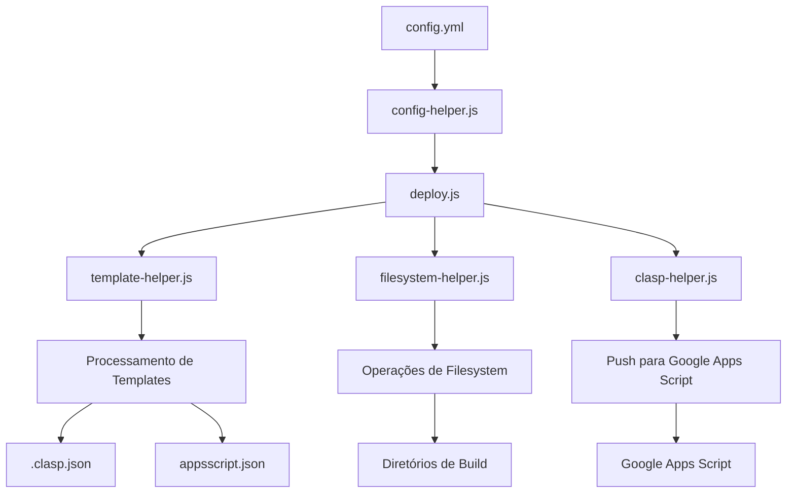

# Plano de Melhorias da Documentação do GAS Builder

> Data: 02/05/2025

## Objetivos

Este documento detalha o plano de melhorias da documentação do sistema GAS Builder, com o objetivo de:

1. Tornar o projeto mais acessível para novos usuários
2. Facilitar a manutenção e extensão do código
3. Preparar o projeto para se tornar público
4. Implementar suporte a múltiplos idiomas (português e inglês)

## Estrutura da Documentação Proposta

```
docs/
├── api/                      # Documentação de API gerada automaticamente
├── guias/                    # Guias passo a passo
│   ├── primeiros-passos.md
│   ├── criando-novo-projeto.md
│   ├── deploy-producao.md
│   └── troubleshooting.md
├── arquitetura/              # Documentação de arquitetura
│   ├── visao-geral.md
│   ├── fluxo-build.md
│   └── diagramas/
├── exemplos/                 # Exemplos práticos
│   ├── planilha-basica/
│   ├── add-on-docs/
│   └── integracao-api/
└── referencia/               # Documentação de referência
    ├── config-yml.md
    ├── linha-comando.md
    └── templates.md
```

## Fase 1: Documentação de Código (Semanas 1-2)

### 1.1. Implementação de JSDoc/TSDoc

- **Objetivo**: Documentar todos os módulos, funções, classes e interfaces com comentários padronizados
- **Tarefas**:
  - Definir padrão de documentação (formato, obrigatoriedade, etc.)
  - Documentar scripts do sistema de build (scripts/build-system/)
  - Documentar módulos compartilhados (src/commons/)
  - Documentar projetos de exemplo (src/example/)
  - Adicionar exemplos de uso para funções principais

**Exemplo de padrão JSDoc a ser implementado**:

```typescript
/**
 * Processa um template Handlebars com as variáveis fornecidas
 * 
 * @param {string} templatePath - Caminho absoluto ou relativo para o arquivo de template
 * @param {string} outputPath - Caminho absoluto ou relativo para o arquivo de saída
 * @param {object} context - Objeto contendo as variáveis a serem substituídas no template
 * @returns {boolean} - Verdadeiro se o processamento foi bem-sucedido, falso caso contrário
 * @throws {Error} - Se o template não puder ser compilado
 * 
 * @example
 * // Processar um template com variáveis
 * processTemplate(
 *   'templates/appsscript.json.template',
 *   'build/example/appsscript.json',
 *   { timeZone: 'America/Sao_Paulo', runtimeVersion: 'V8' }
 * );
 */
```

### 1.2. Configuração de TypeDoc

- **Objetivo**: Configurar TypeDoc para gerar documentação automática a partir dos comentários JSDoc/TSDoc
- **Tarefas**:
  - Instalar e configurar TypeDoc
  - Criar script para geração de documentação
  - Integrar com pipeline de CI/CD
  - Configurar tema e personalização visual

## Fase 2: Documentação de Arquitetura (Semanas 3-4)

### 2.1. Diagramas de Arquitetura

- **Objetivo**: Criar representações visuais do sistema e seus componentes
- **Tarefas**:
  - Criar diagrama de fluxo do processo de build e deploy
  - Criar diagrama de componentes mostrando relações entre módulos
  - Criar diagrama de sequência para fluxo de trabalho típico
  - Documentar pontos de extensão e personalização

**Exemplo de diagrama Mermaid para o fluxo de build**:



### 2.2. Documentação de Configuração

- **Objetivo**: Documentar detalhadamente o arquivo de configuração YAML
- **Tarefas**:
  - Documentar todas as opções possíveis com exemplos
  - Criar guia de referência rápida
  - Documentar relação entre configurações e comportamento
  - Adicionar exemplos para diferentes cenários

## Fase 3: Guias Práticos (Semanas 4-5)

### 3.1. Guia de Início Rápido

- **Objetivo**: Criar um guia passo a passo para novos usuários
- **Tarefas**:
  - Documentar pré-requisitos e instalação
  - Criar tutorial de configuração inicial
  - Documentar comandos básicos
  - Incluir exemplos de uso comum

### 3.2. Tutoriais Específicos

- **Objetivo**: Criar tutoriais para casos de uso específicos
- **Tarefas**:
  - Tutorial de criação de projeto do zero
  - Tutorial de migração de projeto existente
  - Tutorial de configuração de múltiplos ambientes
  - Tutorial de troubleshooting para problemas comuns

### 3.3. Exemplos Práticos

- **Objetivo**: Criar exemplos completos de projetos
- **Tarefas**:
  - Exemplo de automação de planilha
  - Exemplo de add-on para Google Docs
  - Exemplo de integração com API externa
  - Exemplo de uso de bibliotecas externas

## Fase 4: Reestruturação da Documentação Existente (Semanas 5-6)

### 4.1. Revisão do README

- **Objetivo**: Atualizar o README principal para ser mais conciso e informativo
- **Tarefas**:
  - Adicionar badges de status (build, cobertura de testes, versão)
  - Reorganizar informações em seções lógicas
  - Adicionar links para documentação detalhada
  - Incluir seção de contribuição para novos desenvolvedores

### 4.2. Organização dos Documentos

- **Objetivo**: Organizar a documentação em categorias lógicas
- **Tarefas**:
  - Criar estrutura de diretórios para documentação
  - Adicionar índice e navegação entre documentos
  - Padronizar formato e estilo dos documentos
  - Remover informações duplicadas ou desatualizadas

## Fase 5: Internacionalização (Semanas 6-10)

### 5.1. Tradução para Inglês

- **Objetivo**: Traduzir toda a documentação para inglês
- **Tarefas**:
  - Traduzir README e documentação principal
  - Traduzir guias e tutoriais
  - Traduzir comentários no código
  - Traduzir mensagens de erro e logs

### 5.2. Estrutura Multilíngue

- **Objetivo**: Implementar estrutura para suporte a múltiplos idiomas
- **Tarefas**:
  - Separar conteúdo em arquivos por idioma
  - Criar sistema de navegação entre versões de idiomas
  - Garantir consistência entre versões
  - Implementar processo para manter traduções atualizadas

## Ferramentas Recomendadas

- **TypeDoc**: Para geração automática de documentação a partir de comentários JSDoc/TSDoc
- **Mermaid/PlantUML**: Para criação de diagramas incluídos diretamente no Markdown
- **Docusaurus/VuePress**: Para criar um site de documentação completo (fase futura)
- **Jest HTML Reporter**: Para gerar relatórios visuais de cobertura de testes

## Cronograma Detalhado

| Fase | Tarefa | Semanas | Prioridade |
|------|--------|---------|------------|
| 1.1 | Implementação de JSDoc/TSDoc | 1-2 | Alta |
| 1.2 | Configuração de TypeDoc | 1-2 | Média |
| 2.1 | Diagramas de Arquitetura | 3-4 | Alta |
| 2.2 | Documentação de Configuração | 3-4 | Alta |
| 3.1 | Guia de Início Rápido | 4-5 | Alta |
| 3.2 | Tutoriais Específicos | 4-5 | Média |
| 3.3 | Exemplos Práticos | 4-5 | Média |
| 4.1 | Revisão do README | 5-6 | Alta |
| 4.2 | Organização dos Documentos | 5-6 | Alta |
| 5.1 | Tradução para Inglês | 6-10 | Média |
| 5.2 | Estrutura Multilíngue | 6-10 | Baixa |

## Métricas de Sucesso

- **Cobertura de Documentação**: 100% das funções públicas documentadas
- **Qualidade de Código**: Redução de avisos de lint relacionados à documentação
- **Acessibilidade**: Feedback positivo de novos usuários sobre clareza da documentação
- **Internacionalização**: 100% da documentação principal disponível em inglês
- **Manutenção**: Processo estabelecido para manter a documentação atualizada

## Próximos Passos após Implementação

1. **Site de Documentação**: Implementar um site completo usando Docusaurus ou VuePress
2. **Vídeos e Screencasts**: Criar conteúdo visual demonstrando o uso do sistema
3. **Comunidade**: Estabelecer canais para feedback e contribuição da comunidade
4. **Suporte a Mais Idiomas**: Expandir suporte para outros idiomas além de português e inglês
