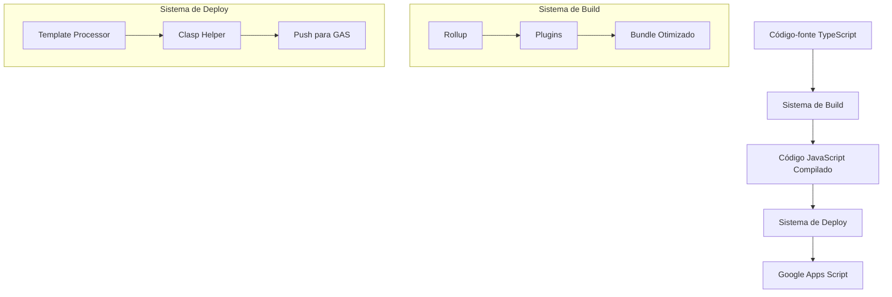
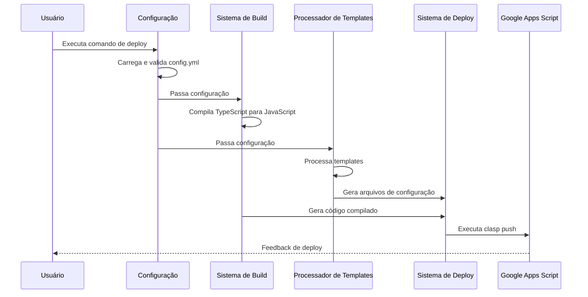

# Documentação de Arquitetura do GAS Builder

> Data: 02/05/2025

Este documento descreve a arquitetura do sistema Google Apps Script Builder, seus componentes principais, fluxos de trabalho e pontos de extensão. Esta documentação é parte da [Fase 1.7: Documentação Avançada](./00-roadmap-gas-builder.md) do roadmap do projeto.

## Visão Geral da Arquitetura

O GAS Builder é um sistema de build e deploy para projetos Google Apps Script, desenvolvido com foco em modularidade, flexibilidade e extensibilidade. A arquitetura é composta por vários componentes que trabalham juntos para transformar código TypeScript em scripts Google Apps Script prontos para deploy.

## Componentes Principais

### 1. Sistema de Configuração

O sistema de configuração é responsável por carregar, validar e processar o arquivo de configuração YAML que define os projetos, ambientes e variáveis.

**Componentes:**
- **config-helper.js**: Carrega e valida a configuração YAML
- **schema/config.schema.json**: Define o schema para validação da configuração

**Fluxo de Trabalho:**
1. Carrega o arquivo YAML
2. Valida contra o schema JSON
3. Processa e normaliza a configuração
4. Resolve caminhos e variáveis

### 2. Sistema de Build

O sistema de build é responsável por compilar o código TypeScript para JavaScript otimizado para o Google Apps Script.

**Componentes:**
- **rollup.config.js**: Configuração principal do Rollup
- **Plugins**: Plugins do Rollup para transformação de código
- **removeImports**: Plugin personalizado para remover imports/exports

**Fluxo de Trabalho:**
1. Lê os arquivos TypeScript de entrada
2. Transpila para JavaScript
3. Resolve dependências
4. Gera bundle otimizado
5. Remove imports/exports (não suportados pelo GAS)
6. Gera arquivos JavaScript finais

### 3. Processador de Templates

O processador de templates é responsável por gerar arquivos de configuração específicos para cada projeto e ambiente.

**Componentes:**
- **template-helper.js**: Processa templates usando Handlebars
- **templates/**: Diretório com templates para diferentes arquivos

**Fluxo de Trabalho:**
1. Carrega o template
2. Compila com Handlebars
3. Substitui variáveis de contexto
4. Gera arquivo final

### 4. Sistema de Deploy

O sistema de deploy é responsável por enviar o código compilado para o Google Apps Script.

**Componentes:**
- **deploy.js**: Script principal de deploy
- **clasp-helper.js**: Integração com a ferramenta clasp
- **filesystem-helper.js**: Operações de filesystem

**Fluxo de Trabalho:**
1. Limpa diretórios de build (opcional)
2. Compila o código TypeScript
3. Processa templates para arquivos de configuração
4. Gera arquivo .clasp.json
5. Executa clasp push
6. Registra resultado do deploy

## Diagrama de Fluxo de Dados

## Pontos de Extensão

O sistema foi projetado com vários pontos de extensão para permitir personalização e adaptação a diferentes necessidades:

### 1. Configuração YAML

A configuração YAML permite definir:
- Múltiplos projetos
- Múltiplos ambientes por projeto
- Variáveis de substituição
- Templates personalizados
- Hooks de build e deploy

### 2. Plugins do Rollup

O sistema de build baseado em Rollup permite:
- Adicionar plugins personalizados
- Configurar transformações específicas
- Personalizar o processo de bundling

### 3. Templates Handlebars

O sistema de templates suporta:
- Templates personalizados
- Helpers Handlebars customizados
- Variáveis de contexto dinâmicas

### 4. Scripts de Build/Deploy

Os scripts de build e deploy podem ser estendidos para:
- Adicionar etapas personalizadas
- Integrar com ferramentas externas
- Implementar lógicas específicas de projeto

## Fluxo de Trabalho Típico

### Desenvolvimento Local

1. Desenvolver código TypeScript em `src/<projeto>/`
2. Executar `pnpm run build` para compilar
3. Verificar resultado em `build/<projeto>/`

### Deploy para Ambiente de Desenvolvimento

1. Configurar ambiente `dev` no `config.yml`
2. Executar `pnpm run deploy:dev -- --project=<projeto>`
3. Verificar deploy no Google Apps Script

### Deploy para Ambiente de Produção

1. Configurar ambiente `prod` no `config.yml`
2. Executar `pnpm run deploy:prod -- --project=<projeto>`
3. Verificar deploy no Google Apps Script

## Considerações de Design

### Modularidade

O sistema foi projetado com alta modularidade, separando claramente as responsabilidades:
- Configuração
- Build
- Processamento de templates
- Deploy

### Flexibilidade

A flexibilidade é garantida através de:
- Configuração extensível via YAML
- Suporte a múltiplos ambientes
- Personalização via templates
- Opções de linha de comando

### Manutenibilidade

A manutenibilidade é priorizada através de:
- Código bem documentado
- Separação clara de responsabilidades
- Testes unitários
- Validação de configuração

## Limitações Conhecidas

1. **Suporte a ESM**: O Google Apps Script não suporta módulos ES6, por isso imports/exports são removidos no bundle final.
2. **Bibliotecas Externas**: Nem todas as bibliotecas npm são compatíveis com o ambiente GAS.
3. **Tamanho do Bundle**: O GAS tem limitações de tamanho para scripts, o que pode ser um problema para projetos grandes.

## Evolução Futura

De acordo com o [roadmap](./00-roadmap-gas-builder.md), a arquitetura evoluirá para:
1. Um template/starter independente (Etapa 2)
2. Uma biblioteca/CLI completa (Etapa 3)

Essas evoluções manterão os princípios arquiteturais, mas adicionarão:
- Maior modularidade
- API programática
- Sistema de plugins
- Integração com ferramentas de CI/CD

## Referências

- [Documentação do Rollup](https://rollupjs.org/)
- [Documentação do Clasp](https://github.com/google/clasp)
- [Documentação do Google Apps Script](https://developers.google.com/apps-script)
- [Configuração YAML](./20-ref-configuracao-yaml.md)
- [Guia do Sistema de Build](./20-guia-sistema-build.md)

---

Este documento faz parte da [Fase 1.7: Documentação Avançada](./00-roadmap-gas-builder.md) do roadmap do projeto e está alinhado com o [plano de melhorias da documentação](./17-plano-melhorias-documentacao.md).
