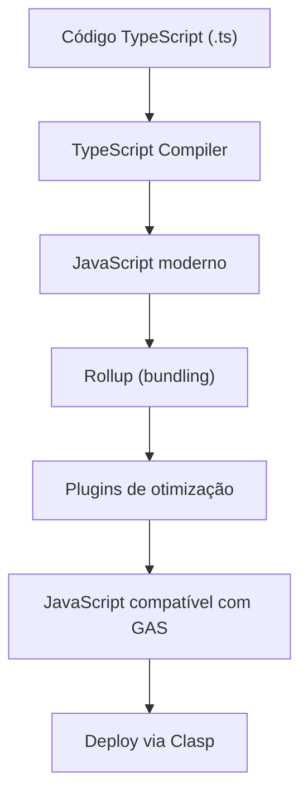

# Referência do Sistema de Build

> Última atualização: 08/05/2025

## Resumo

Este documento fornece uma referência detalhada do sistema de build do GAS Builder, implementado em JavaScript e baseado em Rollup. O sistema processa código JavaScript ou TypeScript para gerar código JavaScript compatível com Google Apps Script, produzindo arquivos otimizados prontos para deploy, incluindo suporte a módulos e dependências.

## Pré-requisitos

- Conhecimento básico de JavaScript e/ou [TypeScript](https://www.typescriptlang.org/docs/)
- Familiaridade com [Rollup](https://rollupjs.org/)
- Node.js 18+ e pnpm instalados
- [Clasp](https://github.com/google/clasp) configurado para o projeto

## 1. Visão Geral do Sistema de Build

O sistema de build do GAS Builder, implementado em JavaScript, é projetado para:

1. Processar código JavaScript ou compilar código TypeScript para JavaScript compatível com Google Apps Script
2. Processar e resolver dependências, incluindo módulos externos
3. Otimizar o código final para melhor performance
4. Facilitar a modularização do código
5. Automatizar o processo de build e deploy

### 1.1. Componentes Principais

O sistema de build consiste em:

- **Rollup**: Bundler principal responsável pela compilação e bundling
- **Plugins do Rollup**: Para processar TypeScript, resolver dependências e otimizar
- **Scripts de build**: Automatizam o processo de compilação
- **Configuração do Clasp**: Para sincronização com o Google Apps Script
- **Ferramentas de análise**: Para verificação de qualidade e tamanho do código

### 1.2. Fluxo do Processo de Build



## 2. Configuração do Rollup

### 2.1. Arquivo de Configuração Principal

O arquivo `rollup.config.js` na raiz do projeto contém a configuração principal:

```javascript
import typescript from '@rollup/plugin-typescript';
import { nodeResolve } from '@rollup/plugin-node-resolve';
import commonjs from '@rollup/plugin-commonjs';
import { terser } from 'rollup-plugin-terser';
import cleanup from 'rollup-plugin-cleanup';
import generateFilesList from './scripts/build/generate-files-list.js';

const isProduction = process.env.NODE_ENV === 'production';
const config = generateFilesList();

export default config.map(entry => ({
  input: entry.input,
  output: {
    file: entry.output,
    format: 'esm',
    exports: 'auto'
  },
  plugins: [
    nodeResolve({
      preferBuiltins: true,
      mainFields: ['module', 'main']
    }),
    commonjs(),
    typescript({
      tsconfig: './tsconfig.json',
      sourceMap: !isProduction
    }),
    cleanup({
      comments: 'jsdoc',
      extensions: ['.js', '.ts']
    }),
    isProduction && terser({
      format: {
        comments: function(node, comment) {
          const text = comment.value;
          const type = comment.type;
          // Manter comentários JSDoc
          return type === 'comment2' && /@(param|returns?|description|example|export|function|global|typedef)\b/.test(text);
        }
      }
    })
  ],
  external: entry.external || [],
  onwarn: (warning, warn) => {
    // Ignorar avisos específicos
    if (warning.code === 'CIRCULAR_DEPENDENCY') return;
    warn(warning);
  }
}));
```

### 2.2. Plugins Utilizados

| Plugin | Descrição |
|--------|-----------|
| **@rollup/plugin-typescript** | Compila TypeScript para JavaScript |
| **@rollup/plugin-node-resolve** | Resolve módulos do Node.js |
| **@rollup/plugin-commonjs** | Converte módulos CommonJS para ES |
| **rollup-plugin-terser** | Minifica o código JavaScript |
| **rollup-plugin-cleanup** | Remove comentários desnecessários |

### 2.3. Configuração de Entrada e Saída

O sistema utiliza um script personalizado `generate-files-list.js` para automaticamente:

1. Detectar arquivos de entrada baseados na estrutura do projeto
2. Configurar arquivos de saída correspondentes
3. Definir dependências externas por módulo

## 3. Configuração do TypeScript

### 3.1. Arquivo tsconfig.json

```json
{
  "compilerOptions": {
    "target": "ES2019",
    "module": "ESNext",
    "lib": ["ES2020"],
    "strict": true,
    "noImplicitAny": true,
    "strictNullChecks": true,
    "noUnusedLocals": true,
    "noUnusedParameters": true,
    "moduleResolution": "node",
    "esModuleInterop": true,
    "experimentalDecorators": true,
    "emitDecoratorMetadata": true,
    "skipLibCheck": true,
    "forceConsistentCasingInFileNames": true,
    "resolveJsonModule": true,
    "declaration": true,
    "declarationDir": "./types",
    "outDir": "./build",
    "baseUrl": ".",
    "paths": {
      "@core/*": ["src/core/*"],
      "@plugins/*": ["src/plugins/*"],
      "@templates/*": ["src/templates/*"],
      "@shared/*": ["shared/*"]
    }
  },
  "include": [
    "src/**/*.ts",
    "shared/**/*.ts"
  ],
  "exclude": [
    "node_modules",
    "tests",
    "build",
    "**/*.spec.ts"
  ]
}
```

### 3.2. Considerações Importantes

- **Target ES2019**: Compatibilidade com Google Apps Script
- **Module ESNext**: Para suporte a módulos ES modernos
- **Paths Aliases**: Facilitam importações entre módulos
- **Declaration Files**: Geração automática de tipos
- **Strict Mode**: Garantia de qualidade de código

## 4. Configuração do Clasp

### 4.1. Arquivo .clasp.json

```json
{
  "scriptId": "1abc123def456ghij789klmno",
  "rootDir": "build",
  "projectId": "gas-builder-project",
  "fileExtension": "js",
  "filePushOrder": [
    "build/enums.js",
    "build/types.js",
    "build/config.js"
  ]
}
```

### 4.2. Integração com o Build Process

O Clasp é integrado ao sistema de build através dos scripts no `package.json`:

```json
"scripts": {
  "build": "rollup -c",
  "build:watch": "rollup -c -w",
  "build:prod": "NODE_ENV=production rollup -c",
  "deploy": "npm run build && clasp push",
  "deploy:prod": "npm run build:prod && clasp push"
}
```

## 5. Scripts de Build

### 5.1. Geração de Lista de Arquivos

O script `generate-files-list.js` é responsável por identificar os módulos a serem compilados:

```javascript
import fs from 'fs';
import path from 'path';
import { fileURLToPath } from 'url';

const __dirname = path.dirname(fileURLToPath(import.meta.url));
const projectRoot = path.resolve(__dirname, '../..');

export default function generateFilesList() {
  const entries = [];
  const srcDir = path.join(projectRoot, 'src');
  
  // Detectar módulos principais
  const mainModules = fs.readdirSync(srcDir, { withFileTypes: true })
    .filter(dirent => dirent.isDirectory())
    .map(dirent => dirent.name);
  
  // Adicionar entradas para cada módulo
  for (const module of mainModules) {
    const moduleDir = path.join(srcDir, module);
    const files = fs.readdirSync(moduleDir, { withFileTypes: true })
      .filter(dirent => dirent.isFile() && dirent.name.endsWith('.ts') && !dirent.name.endsWith('.test.ts'))
      .map(dirent => dirent.name);
    
    for (const file of files) {
      const baseName = path.basename(file, '.ts');
      entries.push({
        input: path.join(moduleDir, file),
        output: path.join(projectRoot, 'build', module, `${baseName}.js`),
        external: ['@core/types', '@core/config'] // Módulos a serem mantidos separados
      });
    }
  }
  
  return entries;
}
```

### 5.2. Limpeza de Build

O script `clean-build.js` remove artefatos anteriores de build:

```javascript
import fs from 'fs';
import path from 'path';
import { fileURLToPath } from 'url';

const __dirname = path.dirname(fileURLToPath(import.meta.url));
const buildDir = path.resolve(__dirname, '../../build');

// Remove o diretório build se existir
if (fs.existsSync(buildDir)) {
  fs.rmSync(buildDir, { recursive: true, force: true });
  console.log('Diretório build removido com sucesso.');
}

// Cria o diretório build vazio
fs.mkdirSync(buildDir, { recursive: true });
console.log('Diretório build criado com sucesso.');
```

### 5.3. Validação de Tamanho de Build

O script `analyze-bundle-size.js` verifica o tamanho dos arquivos gerados:

```javascript
import fs from 'fs';
import path from 'path';
import { fileURLToPath } from 'url';

const __dirname = path.dirname(fileURLToPath(import.meta.url));
const buildDir = path.resolve(__dirname, '../../build');

// Tamanho máximo permitido (250KB para todo o bundle)
const MAX_BUNDLE_SIZE = 250 * 1024;
let totalSize = 0;
const fileSizes = [];

function getFilesizeInBytes(filename) {
  const stats = fs.statSync(filename);
  return stats.size;
}

function formatBytes(bytes, decimals = 2) {
  if (bytes === 0) return '0 Bytes';
  
  const k = 1024;
  const dm = decimals < 0 ? 0 : decimals;
  const sizes = ['Bytes', 'KB', 'MB', 'GB'];
  
  const i = Math.floor(Math.log(bytes) / Math.log(k));
  
  return parseFloat((bytes / Math.pow(k, i)).toFixed(dm)) + ' ' + sizes[i];
}

function analyzeBundleSize(dir) {
  const items = fs.readdirSync(dir, { withFileTypes: true });
  
  for (const item of items) {
    const fullPath = path.join(dir, item.name);
    
    if (item.isDirectory()) {
      analyzeBundleSize(fullPath);
    } else if (item.isFile() && item.name.endsWith('.js')) {
      const size = getFilesizeInBytes(fullPath);
      totalSize += size;
      fileSizes.push({
        path: fullPath.replace(buildDir + '/', ''),
        size,
        formattedSize: formatBytes(size)
      });
    }
  }
}

analyzeBundleSize(buildDir);

// Ordenar por tamanho (maior primeiro)
fileSizes.sort((a, b) => b.size - a.size);

console.log('Análise de tamanho do bundle:');
console.log('---------------------------');
fileSizes.forEach(file => {
  console.log(`${file.path}: ${file.formattedSize}`);
});
console.log('---------------------------');
console.log(`Total: ${formatBytes(totalSize)}`);

if (totalSize > MAX_BUNDLE_SIZE) {
  console.warn(`⚠️ ATENÇÃO: O tamanho total do bundle (${formatBytes(totalSize)}) excede o máximo recomendado de ${formatBytes(MAX_BUNDLE_SIZE)}`);
  console.warn('Considere otimizar ou dividir o código em múltiplos projetos.');
} else {
  console.log(`✅ O tamanho do bundle está dentro do limite recomendado (${formatBytes(totalSize)} / ${formatBytes(MAX_BUNDLE_SIZE)})`);
}
```

## 6. Integração ESLint e Prettier

### 6.1. Configuração ESLint

O arquivo `.eslintrc.js` integra-se com o sistema de build:

```javascript
module.exports = {
  root: true,
  parser: '@typescript-eslint/parser',
  plugins: [
    '@typescript-eslint',
    'googleappsscript'
  ],
  extends: [
    'eslint:recommended',
    'plugin:@typescript-eslint/recommended',
    'plugin:googleappsscript/recommended'
  ],
  env: {
    node: true,
    es2020: true
  },
  rules: {
    'no-console': process.env.NODE_ENV === 'production' ? 'warn' : 'off',
    'no-debugger': process.env.NODE_ENV === 'production' ? 'error' : 'off',
    '@typescript-eslint/no-explicit-any': 'warn',
    'googleappsscript/valid-apps-script-object': 'error'
  },
  overrides: [
    {
      files: ['rollup.config.js', 'scripts/**/*.js'],
      env: { node: true },
      rules: { '@typescript-eslint/no-var-requires': 'off' }
    }
  ]
};
```

### 6.2. Configuração Prettier

O arquivo `.prettierrc` define o estilo de formatação:

```json
{
  "singleQuote": true,
  "trailingComma": "es5",
  "printWidth": 100,
  "tabWidth": 2,
  "semi": true,
  "arrowParens": "avoid",
  "endOfLine": "lf"
}
```

## 7. Personalização e Extensão

### 7.1. Adicionando Plugins Customizados

Para estender o sistema de build com plugins personalizados:

1. Crie um plugin em `scripts/build/plugins/`
2. Importe-o na configuração do Rollup
3. Adicione à lista de plugins

Exemplo de plugin personalizado:

```javascript
// scripts/build/plugins/gas-header.js
export default function gasHeader() {
  return {
    name: 'gas-header',
    renderChunk(code) {
      const header = `/**
 * @fileoverview Gerado por GAS Builder
 * @date ${new Date().toISOString()}
 * @version ${process.env.npm_package_version}
 */\n\n`;
      return header + code;
    }
  };
}
```

### 7.2. Extensões para Configurações Específicas

Para projetos com necessidades específicas, crie configurações alternativas:

```javascript
// rollup.config.advanced.js
import baseConfig from './rollup.config';
import gasHeader from './scripts/build/plugins/gas-header';

export default baseConfig.map(config => {
  return {
    ...config,
    plugins: [
      ...config.plugins,
      gasHeader()
    ]
  };
});
```

## 8. Práticas Recomendadas

### 8.1. Otimização de Performance

- **Modularize seu código**: Divida em módulos lógicos
- **Use tree-shaking**: Importe apenas o que usa
- **Evite dependências pesadas**: Prefira código nativo
- **Monitore o tamanho do bundle**: Use o script de análise regularmente

### 8.2. Compatibilidade com Google Apps Script

- **Use recursos compatíveis**: Nem todos recursos do ES2019+ funcionam
- **Teste em ambiente real**: Algumas construções TypeScript podem gerar código incompatível
- **Atente-se aos limites do GAS**: Tamanho máximo de scripts, tempos de execução, etc.

### 8.3. Estrutura de Arquivos Recomendada

```bash
src/
  ├── core/         # Núcleo do sistema
  │   ├── types.ts  # Tipos comuns
  │   ├── config.ts # Configurações
  │   └── utils.ts  # Utilitários
  ├── modules/      # Módulos específicos
  │   ├── moduleA/  # Módulo A
  │   └── moduleB/  # Módulo B
  └── entry-points/ # Pontos de entrada para o GAS
      ├── main.ts   # Funções globais principais
      └── ui.ts     # Interface de usuário
```

## 9. Troubleshooting Comum

### 9.1. Erros de Compilação

| Erro | Causas Possíveis | Solução |
|------|------------------|---------|
| **Could not resolve dependency** | Caminho incorreto ou módulo ausente | Verifique as importações e instale dependências |
| **TypeScript error** | Erro de tipo ou sintaxe TS | Corrija conforme sugerido pelo compilador |
| **Unexpected token** | Sintaxe ES não suportada | Use sintaxe compatível ou configure transpilação |

### 9.2. Erros de Deploy

| Erro | Causas Possíveis | Solução |
|------|------------------|---------|
| **Exceeded maximum script size** | Bundle muito grande | Divida em múltiplos scripts ou otimize |
| **Invalid script file** | Código incompatível com GAS | Verifique construções avançadas de JS |
| **Manifest not found** | Configuração do Clasp incorreta | Verifique .clasp.json e rootDir |

## 10. Recursos Adicionais

### 10.1. Scripts Disponíveis

| Script | Descrição |
|--------|-----------|
| `pnpm build` | Compila o projeto |
| `pnpm build:watch` | Compila em modo watch |
| `pnpm build:prod` | Compila com otimizações de produção |
| `pnpm deploy` | Compila e faz deploy com Clasp |
| `pnpm deploy:prod` | Compila com otimizações e faz deploy |
| `pnpm lint` | Verifica linting do código |
| `pnpm lint:fix` | Corrige problemas de linting |
| `pnpm analyze` | Analisa tamanho do bundle |

### 10.2. Configurações Adicionais

Arquivos de configuração complementares:

- **.claspignore**: Define arquivos ignorados pelo deploy do Clasp
- **.eslintignore**: Define arquivos ignorados pelo ESLint
- **.prettierignore**: Define arquivos ignorados pelo Prettier

## Próximos Passos

- Consulte o [guia de início rápido](./10-guia-inicio-rapido.md) para começar um projeto
- Explore a [referência de configuração YAML](./20-ref-configuracao-yaml.md) para personalizar sua configuração
- Veja a [documentação de arquitetura](./02-arquitetura-gas-builder.md) para entender como o sistema funciona

## Referências

- [Documentação do Rollup](https://rollupjs.org/guide/en/)
- [Documentação do TypeScript](https://www.typescriptlang.org/docs/)
- [Documentação do Google Apps Script](https://developers.google.com/apps-script/)
- [Repositório do Clasp](https://github.com/google/clasp)
- [ESLint](https://eslint.org/docs/user-guide/configuring/)
- [Prettier](https://prettier.io/docs/en/)
