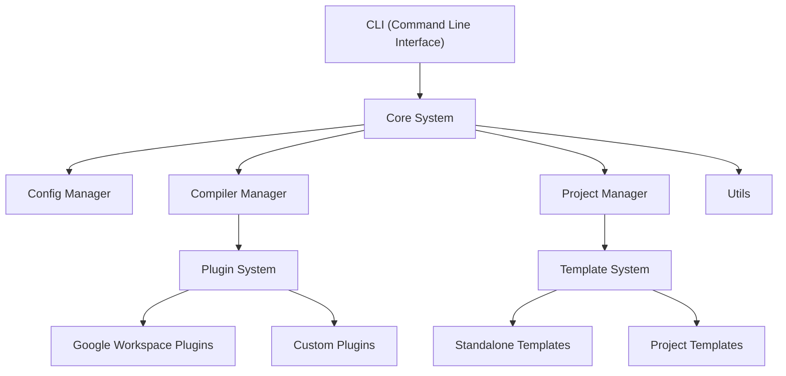
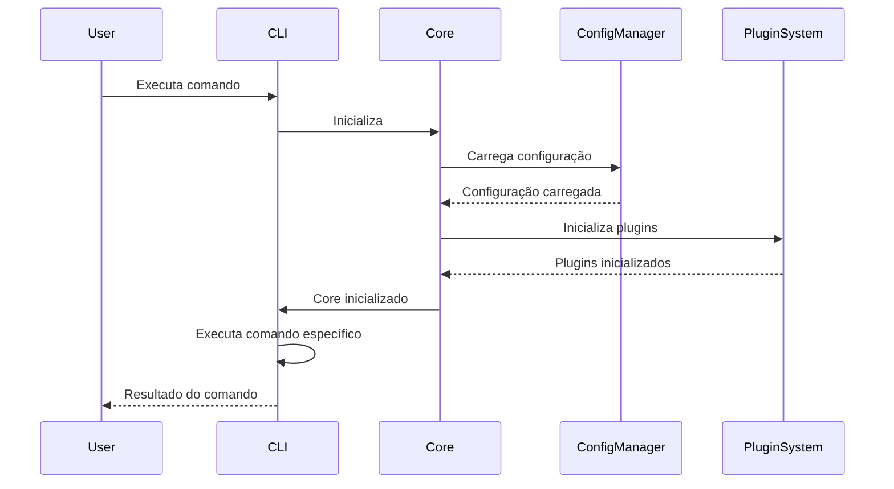
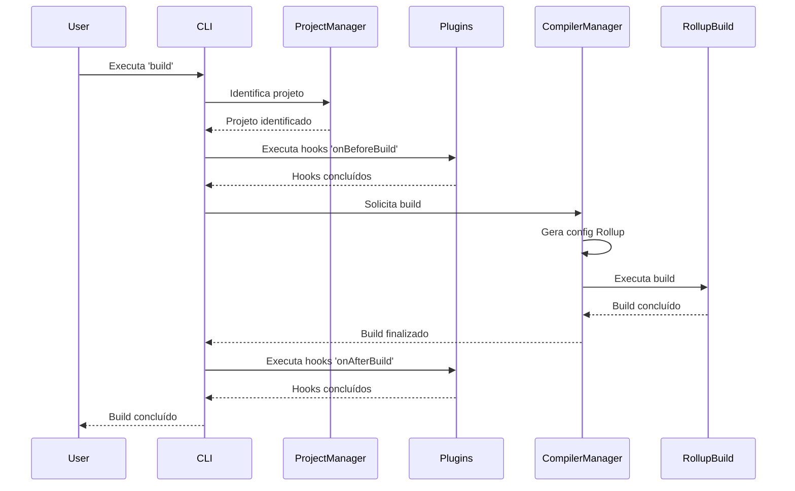
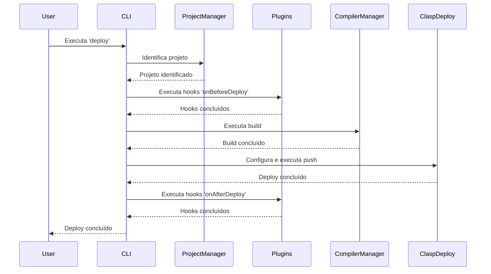

# Referência da Arquitetura Técnica

> Última atualização: 06/05/2025

## Resumo

Este documento detalha a arquitetura técnica do GAS Builder, incluindo sua estrutura de componentes, fluxo de dados e princípios de design. É destinado a desenvolvedores que precisam entender o funcionamento interno do sistema para extensão, manutenção ou integração.

## Pré-requisitos

- Conhecimento de [TypeScript](https://www.typescriptlang.org/docs/)
- Familiaridade com [Google Apps Script](https://developers.google.com/apps-script/)
- Entendimento de [arquitetura modular](https://en.wikipedia.org/wiki/Modular_programming)
- Compreensão de [sistemas de build](./21-ref-sistema-build.md)

## 1. Visão Geral da Arquitetura

O GAS Builder segue uma arquitetura modular baseada em plugins, onde:

1. O **Core** fornece funcionalidades fundamentais e APIs
2. Os **Plugins** estendem o sistema com capacidades específicas
3. Os **Templates** definem estruturas reutilizáveis
4. A **CLI** oferece interface de linha de comando
5. O **Build System** compila e otimiza o código

### 1.1. Princípios Arquiteturais

- **Modularidade**: Componentes independentes com interfaces bem definidas
- **Extensibilidade**: Facilidade para adicionar novas funcionalidades via plugins
- **Configurabilidade**: Personalização via arquivos de configuração YAML
- **Testabilidade**: Design que facilita testes automatizados
- **Consistência**: Padrões uniformes em todo o sistema

### 1.2. Visão de Alto Nível



## 2. Componentes Principais

### 2.1. Core System

O núcleo do GAS Builder é composto por módulos fundamentais que gerenciam o fluxo de trabalho:

#### 2.1.1. Config Manager

Responsável pelo carregamento, validação e acesso às configurações:

```typescript
// Exemplo simplificado da API
interface ConfigManager {
  loadConfig(path: string): Promise<Config>;
  validateConfig(config: Config): ValidationResult;
  getProjectConfig(projectId: string): ProjectConfig;
  mergeEnvironmentConfig(baseConfig: Config, env: string): Config;
}
```

#### 2.1.2. Compiler Manager

Gerencia o processo de compilação do código TypeScript para JavaScript:

```typescript
interface CompilerManager {
  compileProject(projectId: string, options?: CompileOptions): Promise<CompileResult>;
  generateRollupConfig(project: ProjectConfig): RollupConfig;
  runBuild(config: BuildConfig): Promise<BuildResult>;
}
```

#### 2.1.3. Project Manager

Gerencia a estrutura e operações dos projetos:

```typescript
interface ProjectManager {
  createProject(name: string, template: string): Promise<Project>;
  listProjects(): Project[];
  getProject(id: string): Project;
  syncProject(id: string, options?: SyncOptions): Promise<SyncResult>;
}
```

#### 2.1.4. Utils

Utilitários compartilhados entre componentes:

```typescript
// Exemplos de utilitários disponíveis
const fileUtils: FileUtils;       // Operações de arquivo
const logUtils: LogUtils;         // Sistema de logging
const validationUtils: ValidUtils; // Validações comuns
const tempDirUtils: TempDirUtils; // Gerenciamento de diretórios temporários
```

### 2.2. Plugin System

Sistema extensível que permite adicionar funcionalidades ao GAS Builder:

```typescript
interface Plugin {
  id: string;
  name: string;
  description: string;
  version: string;
  
  // Hooks do ciclo de vida
  initialize(context: PluginContext): Promise<void>;
  onBeforeBuild?(context: BuildContext): Promise<void>;
  onAfterBuild?(context: BuildContext): Promise<void>;
  onBeforeDeploy?(context: DeployContext): Promise<void>;
  onAfterDeploy?(context: DeployContext): Promise<void>;
  
  // Comandos personalizados
  commands?: Record<string, Command>;
}
```

### 2.3. Template System

Sistema para criação e uso de templates de projeto:

```typescript
interface Template {
  id: string;
  name: string;
  description: string;
  version: string;
  
  // Métodos principais
  generate(destination: string, options: TemplateOptions): Promise<void>;
  getVariables(): TemplateVariable[];
  validateOptions(options: TemplateOptions): ValidationResult;
}
```

### 2.4. CLI

Interface de linha de comando para interação com o GAS Builder:

```typescript
interface CLI {
  registerCommand(name: string, handler: CommandHandler): void;
  registerGlobalOptions(options: CLIOption[]): void;
  parse(args: string[]): Promise<void>;
  run(command: string, options?: any): Promise<void>;
}
```

## 3. Fluxos Principais

### 3.1. Fluxo de Inicialização

1. CLI carrega e parseia argumentos
2. Core é inicializado
3. Config Manager carrega configuração
4. Plugins são carregados e inicializados
5. Comando específico é executado



### 3.2. Fluxo de Build

1. Comando `build` é invocado
2. Project Manager identifica o projeto alvo
3. Plugins de pré-build são executados
4. Compiler Manager gera configuração do Rollup
5. Build é executado
6. Plugins de pós-build são executados



### 3.3. Fluxo de Deploy

1. Comando `deploy` é invocado
2. Project Manager identifica o projeto alvo
3. Plugins de pré-deploy são executados
4. Build é executado (se necessário)
5. Clasp é configurado e push é executado
6. Plugins de pós-deploy são executados



## 4. Módulos e Diretórios

### 4.1. Estrutura de Diretórios

```bash
/
├── src/                     # Código fonte principal
│   ├── core/                # Componentes do núcleo
│   │   ├── config/          # Gerenciamento de configuração
│   │   ├── compiler/        # Compilação e build
│   │   ├── project/         # Gerenciamento de projetos
│   │   └── utils/           # Utilitários compartilhados
│   ├── plugins/             # Sistema de plugins
│   │   ├── base/            # Classes base para plugins
│   │   ├── google-workspace/# Plugins para Google Workspace
│   │   └── custom/          # Plugins personalizados
│   ├── templates/           # Sistema de templates
│   │   ├── base/            # Classes base para templates
│   │   ├── standalone/      # Templates independentes
│   │   └── project/         # Templates de projeto
│   └── cli/                 # Interface de linha de comando
├── shared/                  # Código compartilhado entre módulos
│   ├── types/               # Definições de tipos
│   └── constants/           # Constantes compartilhadas
├── scripts/                 # Scripts de build e utilitários
├── tests/                   # Testes automatizados
│   ├── unit/                # Testes unitários
│   └── integration/         # Testes de integração
└── templates/               # Arquivos de template
```

### 4.2. Principais Módulos

| Módulo | Responsabilidade |
|--------|------------------|
| **core/config** | Gerenciamento de configuração YAML |
| **core/compiler** | Compilação TypeScript e integração com Rollup |
| **core/project** | Gerenciamento de estrutura e operações de projeto |
| **plugins/base** | Framework base para plugins |
| **templates/base** | Framework base para templates |
| **cli** | Interface de linha de comando e handlers |

## 5. Interfaces Principais

### 5.1. Interfaces de Configuração

```typescript
interface Config {
  version: string;
  defaults: DefaultConfig;
  environments: Record<string, EnvironmentConfig>;
  projects: Record<string, ProjectConfig>;
}

interface ProjectConfig {
  id: string;
  name: string;
  type: ProjectType;
  scriptId?: string;
  rootDir: string;
  sourceDir: string;
  outDir: string;
  clasp: ClaspConfig;
  build: BuildConfig;
  plugins: PluginConfig[];
}
```

### 5.2. Interfaces de Plugin

```typescript
interface PluginConfig {
  id: string;
  enabled: boolean;
  options?: Record<string, any>;
}

interface PluginContext {
  config: Config;
  logger: Logger;
  projectManager: ProjectManager;
  fileSystem: FileSystem;
}

interface BuildContext extends PluginContext {
  project: ProjectConfig;
  buildConfig: BuildConfig;
  rollupConfig: RollupConfig;
}
```

### 5.3. Interfaces de Template

```typescript
interface TemplateOptions {
  name: string;
  description?: string;
  author?: string;
  variables?: Record<string, any>;
}

interface TemplateVariable {
  name: string;
  description: string;
  type: 'string' | 'boolean' | 'number' | 'select';
  default?: any;
  required?: boolean;
  options?: string[]; // Para type='select'
}
```

## 6. Extensibilidade

### 6.1. Criação de Plugins

Para criar um novo plugin, implemente a interface `Plugin`:

```typescript
import { Plugin, PluginContext } from '@core/plugins';

export class MyCustomPlugin implements Plugin {
  id = 'my-custom-plugin';
  name = 'My Custom Plugin';
  description = 'Adds custom functionality to GAS Builder';
  version = '1.0.0';
  
  async initialize(context: PluginContext): Promise<void> {
    // Inicialização do plugin
  }
  
  async onBeforeBuild(context: BuildContext): Promise<void> {
    // Lógica pré-build
  }
  
  async onAfterBuild(context: BuildContext): Promise<void> {
    // Lógica pós-build
  }
  
  // Comandos personalizados
  commands = {
    'custom-action': async (args: any) => {
      // Implementação do comando
    }
  };
}
```

### 6.2. Criação de Templates

Para criar um novo template, implemente a interface `Template`:

```typescript
import { Template, TemplateOptions, ValidationResult } from '@core/templates';
import * as fs from 'fs-extra';
import * as path from 'path';

export class MyProjectTemplate implements Template {
  id = 'my-project';
  name = 'My Project Template';
  description = 'Template for creating custom projects';
  version = '1.0.0';
  
  getVariables() {
    return [
      {
        name: 'apiVersion',
        description: 'API version to use',
        type: 'select',
        options: ['v1', 'v2', 'v3'],
        default: 'v2',
        required: true
      }
    ];
  }
  
  validateOptions(options: TemplateOptions): ValidationResult {
    // Validação de opções
    return { valid: true };
  }
  
  async generate(destination: string, options: TemplateOptions): Promise<void> {
    // Lógica de geração do template
    const templateDir = path.resolve(__dirname, '../templates/my-project');
    await fs.copy(templateDir, destination);
    
    // Processamento de variáveis
    const files = await fs.readdir(destination);
    for (const file of files) {
      if (file.endsWith('.template')) {
        const filePath = path.join(destination, file);
        let content = await fs.readFile(filePath, 'utf8');
        
        // Substituir variáveis
        for (const [key, value] of Object.entries(options.variables || {})) {
          content = content.replace(new RegExp(`\\{\\{${key}\\}\\}`, 'g'), value);
        }
        
        const newFilePath = filePath.replace('.template', '');
        await fs.writeFile(newFilePath, content);
        await fs.remove(filePath);
      }
    }
  }
}
```

## 7. Estratégias de Testes

### 7.1. Testes Unitários

Cada componente principal possui testes unitários:

```typescript
// Exemplo de teste unitário para ConfigManager
import { ConfigManager } from '@core/config';
import { jest } from '@jest/globals';

describe('ConfigManager', () => {
  let configManager: ConfigManager;
  
  beforeEach(() => {
    configManager = new ConfigManager();
  });
  
  test('loadConfig carrega configuração válida', async () => {
    const config = await configManager.loadConfig('path/to/config.yml');
    expect(config).toBeDefined();
    expect(config.version).toBe('1.0.0');
  });
  
  test('validateConfig identifica configuração inválida', () => {
    const result = configManager.validateConfig({
      // Configuração inválida
    } as any);
    
    expect(result.valid).toBe(false);
    expect(result.errors.length).toBeGreaterThan(0);
  });
});
```

### 7.2. Testes de Integração

Verificam a interação entre múltiplos componentes:

```typescript
// Exemplo de teste de integração
import { GasBuilder } from '@core/gas-builder';
import { jest } from '@jest/globals';
import * as fs from 'fs-extra';
import * as path from 'path';

describe('GAS Builder Integration', () => {
  let gasBuilder: GasBuilder;
  const testProjectDir = path.resolve(__dirname, '../fixtures/test-project');
  
  beforeEach(async () => {
    await fs.ensureDir(testProjectDir);
    gasBuilder = new GasBuilder();
    await gasBuilder.initialize();
  });
  
  afterEach(async () => {
    await fs.remove(testProjectDir);
  });
  
  test('fluxo completo de build e deploy', async () => {
    // Criar projeto
    await gasBuilder.createProject('test', 'basic', {
      destination: testProjectDir
    });
    
    // Build
    const buildResult = await gasBuilder.buildProject('test');
    expect(buildResult.success).toBe(true);
    expect(fs.existsSync(path.join(testProjectDir, 'build'))).toBe(true);
    
    // Verificar artefatos de build
    const outputFiles = await fs.readdir(path.join(testProjectDir, 'build'));
    expect(outputFiles).toContain('Code.js');
  });
});
```

### 7.3. Mocks para Google Apps Script

O sistema inclui mocks para APIs do Google:

```typescript
// Exemplo de mock para SpreadsheetApp
export const SpreadsheetApp = {
  getActiveSpreadsheet: jest.fn().mockReturnValue({
    getSheets: jest.fn().mockReturnValue([]),
    getSheetByName: jest.fn().mockImplementation((name) => ({
      name,
      getRange: jest.fn().mockImplementation((row, col, numRows, numCols) => ({
        setValue: jest.fn(),
        setValues: jest.fn(),
        getValues: jest.fn().mockReturnValue([[]]),
      })),
    })),
  }),
  // Outros métodos mockados
};
```

## 8. Configuração de Ambiente de Desenvolvimento

### 8.1. Setup para Desenvolvimento

```bash
# Clonar repositório
git clone https://github.com/org/gas-builder.git
cd gas-builder

# Instalar dependências
pnpm install

# Compilar projeto
pnpm build

# Executar testes
pnpm test
```

### 8.2. Estrutura de Configuração VSCode

O projeto inclui configurações para VSCode:

```json
// .vscode/settings.json
{
  "typescript.tsdk": "node_modules/typescript/lib",
  "editor.formatOnSave": true,
  "editor.codeActionsOnSave": {
    "source.fixAll.eslint": true
  },
  "files.associations": {
    "*.gs": "javascript"
  },
  "jest.autoRun": "off",
  "jest.jestCommandLine": "pnpm test --"
}
```

## Próximos Passos

- Explore o [21-ref-sistema-build.md](./21-ref-sistema-build.md) para entender o processo de build
- Consulte o [20-ref-configuracao-yaml.md](./20-ref-configuracao-yaml.md) para detalhes da configuração
- Veja a [arquitetura geral](./02-arquitetura-gas-builder.md) para uma visão de alto nível

## Referências

- [TypeScript Handbook](https://www.typescriptlang.org/docs/handbook/intro.html)
- [Google Apps Script Reference](https://developers.google.com/apps-script/reference)
- [Rollup Plugin Development](https://rollupjs.org/plugin-development/)
- [Jest Testing Framework](https://jestjs.io/docs/getting-started)
- [YAML Specification](https://yaml.org/spec/1.2.2/)
