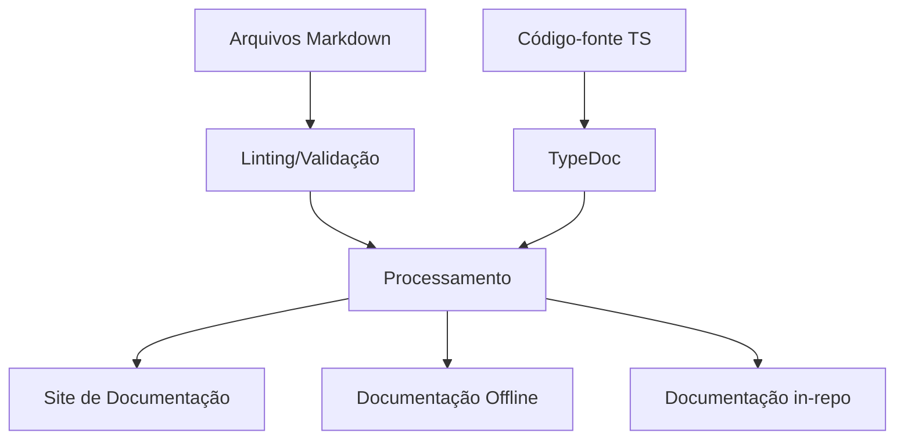

# Plano de Melhorias na Documentação

> Última atualização: 06/05/2025

## Resumo

Este documento apresenta um plano abrangente para melhorar a documentação do GAS Builder, definindo padrões, estrutura e processos para garantir que a documentação seja completa, atualizada e útil para diferentes públicos. A documentação é parte essencial do sucesso do projeto, facilitando a adoção, manutenção e evolução do sistema.

## Pré-requisitos

- Conhecimento básico de Markdown
- Familiaridade com o [sistema GAS Builder](./00-introducao-gas-builder.md)
- Acesso ao repositório do projeto

## 1. Estado Atual da Documentação

### 1.1. Análise da Documentação Existente

Atualmente, a documentação do GAS Builder está organizada nas seguintes categorias:

- **Documentação de Visão Geral**: Introdução e roadmap
- **Documentação Técnica**: Implementação, arquitetura e referência
- **Guias de Uso**: Instruções práticas para usuários
- **Documentação de Código**: Comentários e JSDoc/TSDoc

### 1.2. Problemas Identificados

A análise da documentação atual revelou os seguintes problemas:

- **Inconsistência de formato**: Diferentes estilos e formatos entre documentos
- **Informações desatualizadas**: Algumas partes não refletem o estado atual do código
- **Lacunas de conteúdo**: Faltam documentos para alguns componentes importantes
- **Falta de exemplos práticos**: Poucos exemplos de uso real em cenários comuns
- **Baixa acessibilidade**: Estrutura que dificulta encontrar informações específicas
- **Pouca integração**: Documentação de código separada da documentação geral

## 2. Objetivos e Requisitos

### 2.1. Objetivos Principais

1. **Padronizar a Documentação**: Criar e implementar padrões consistentes
2. **Completar o Conteúdo**: Identificar e preencher lacunas de informação
3. **Melhorar a Experiência**: Facilitar a navegação e compreensão
4. **Automatizar Processos**: Implementar geração e validação automatizada
5. **Habilitar Contribuições**: Simplificar processo para contribuidores externos

### 2.2. Público-Alvo e Necessidades

| Público | Necessidades | Prioridade |
|---------|--------------|------------|
| Desenvolvedores iniciantes | Guias passo a passo, exemplos práticos | Alta |
| Desenvolvedores experientes | Referência técnica, API docs | Alta |
| Contribuidores | Arquitetura, padrões de código | Média |
| Administradores | Configuração, segurança, troubleshooting | Média |
| Stakeholders | Visão geral, roadmap, benefícios | Baixa |

## 3. Estratégia de Documentação

### 3.1. Estrutura Proposta

A estrutura de documentação será organizada nas seguintes categorias principais:

```bash
/docs
├── 00-09: Visão Geral e Arquitetura
│   ├── 00-indice-master.md
│   ├── 00-introducao-gas-builder.md
│   ├── 01-roadmap-gas-builder.md
│   └── 02-arquitetura-gas-builder.md
├── 10-19: Guias de Uso
│   ├── 10-guia-inicio-rapido.md
│   ├── 11-guia-sistema-build.md
│   ├── 12-guia-documentacao-codigo.md
│   └── 19-guia-troubleshooting.md
├── 20-29: Referência Técnica
│   ├── 20-ref-configuracao-yaml.md
│   ├── 21-ref-api.md
│   └── 22-ref-plugins.md
├── 30-39: Implementação e Migração
│   ├── 30-plano-migracao-gas-builder.md
│   ├── 31-plano-migracao-integrado.md
│   ├── 32-impl-core-sistema.md
│   ├── 33-impl-cli.md
│   ├── 34-impl-plugins-templates.md
│   └── 35-prompt-engineering-plan.md
├── 40-49: Qualidade e Testes
│   ├── 40-plano-testes-estabilizacao.md
│   ├── 41-impl-estabilizacao-testes.md
│   ├── 42-melhorias-sistema-testes.md
│   └── 43-plano-melhorias-documentacao.md
└── 50-59: Prompts e Automação
│   ├── 50-indice-prompts.md
│   └── 51-guia-uso-prompts.md
```

### 3.2. Padrões de Formato

Cada documento seguirá um formato padronizado:

```markdown
# Título do Documento

> Última atualização: [DATA]

## Resumo

Breve descrição do propósito e conteúdo do documento (1-2 parágrafos).

## Pré-requisitos

- Conhecimento/ferramentas necessários
- Documentos relacionados
- Outros requisitos

## [Seções de Conteúdo]

### [Subseções]

...

## Próximos Passos

- Links para documentos relacionados
- Ações recomendadas

## Referências

- Links para outros documentos
- Recursos externos
```

### 3.3. Sistema de Navegação

Implementar um sistema de navegação consistente:

1. **Índice Mestre**: Documento central com links organizados por categoria
2. **Breadcrumbs**: Indicação da posição atual na hierarquia no topo de cada documento
3. **Links "Próximo/Anterior"**: Navegação sequencial entre documentos relacionados
4. **Links Contextuais**: Referências a documentos relacionados dentro do conteúdo
5. **Tags**: Sistema de categorização para facilitar busca por tópicos

## 4. Plano de Implementação

### 4.1. Fase 1: Padronização (1-2 semanas)

#### Objetivos

- Definir e documentar padrões de formato e estilo
- Criar templates para diferentes tipos de documentos
- Implementar verificações de linting para Markdown
- Migrar documentos existentes para novo formato

#### Tarefas

1. **Criar Guia de Estilo**
   - Definir regras de formatação (headings, listas, código)
   - Estabelecer padrões de linguagem e terminologia
   - Documentar processo de atualização

2. **Implementar Linting**
   - Configurar markdownlint
   - Integrar com CI/CD
   - Criar scripts de validação

3. **Migrar Documentos Existentes**
   - Aplicar novo formato a documentos prioritários
   - Atualizar links e referências
   - Validar estrutura e navegação

### 4.2. Fase 2: Expansão de Conteúdo (2-3 semanas)

#### 4.2.1 Objetivos

- Identificar e preencher lacunas na documentação
- Expandir guias de uso com exemplos práticos
- Criar documentação de referência técnica detalhada

#### 4.2.2 Tarefas

1. **Auditoria de Conteúdo**
   - Mapear componentes do sistema vs. documentação existente
   - Identificar tópicos ausentes ou incompletos
   - Priorizar criação de novo conteúdo

2. **Criação de Documentos Principais**
   - Referência completa da API
   - Guias passo a passo para cenários comuns
   - Documentação detalhada de configuração

3. **Expansão de Exemplos**
   - Criar exemplos para diferentes casos de uso
   - Adicionar exemplos de código comentados
   - Desenvolver tutoriais completos

### 4.3. Fase 3: Integração com Código (2-3 semanas)

#### 4.3.1 Objetivos

- Melhorar documentação no código (JSDoc/TSDoc)
- Implementar geração automática de documentação
- Integrar documentação de código com documentação geral

#### 4.3.2 Tarefas

1. **Padronização de JSDoc/TSDoc**
   - Definir formato padrão para comentários
   - Documentar todos os componentes públicos
   - Implementar verificação automatizada

2. **Configurar TypeDoc**
   - Configurar geração de documentação a partir do código
   - Personalizar output para integrar com estilo geral
   - Automatizar geração em CI/CD

3. **Implementar Referências Cruzadas**
   - Criar links da documentação para o código
   - Adicionar links do código para a documentação
   - Implementar sistema de versionamento conjunto

### 4.4. Fase 4: Automatização e Manutenção (1-2 semanas)

#### 4.4.1 Objetivos

- Implementar processos para manter documentação atualizada
- Criar ferramentas para facilitar contribuições
- Estabelecer métricas e monitoramento

#### 4.4.2 Tarefas

1. **Automatização de Verificações**
   - Validação de links
   - Detecção de inconsistências
   - Verificação de padrões de formato

2. **Sistema de Contribuições**
   - Criar guia para contribuidores
   - Implementar templates para novos documentos
   - Estabelecer processo de revisão

3. **Métricas e Monitoramento**
   - Rastrear cobertura de documentação
   - Monitorar qualidade e atualidade
   - Coletar feedback dos usuários

## 5. Ferramentas e Tecnologias

### 5.1. Ferramentas de Edição

- **VS Code** com plugins:
  - markdownlint: Validação de Markdown
  - Prettier: Formatação consistente
  - Markdown All in One: Recursos avançados de edição
  - Markdown Preview Enhanced: Visualização rica

### 5.2. Ferramentas de Automação

- **markdownlint-cli**: Validação via linha de comando
- **remark**: Processador de Markdown programável
- **TypeDoc**: Geração de documentação de código
- **markdown-link-check**: Validação de links

### 5.3. Processo de Build



## 6. Diretrizes de Estilo

### 6.1. Linguagem e Tom

- Usar voz ativa e direta
- Focar no usuário ("Você pode..." em vez de "O usuário pode...")
- Manter parágrafos curtos (máximo 4-5 linhas)
- Usar linguagem inclusiva e neutra
- Manter consistência terminológica (glossário compartilhado)

### 6.2. Formatação de Código

- Usar blocos de código com linguagem especificada
- Incluir comentários explicativos em exemplos complexos
- Destacar partes importantes do código
- Manter exemplos completos e funcionais

### 6.3. Elementos Visuais

- Usar diagramas para conceitos complexos
- Implementar tabelas para informações estruturadas
- Incluir capturas de tela para interfaces visuais
- Manter formato consistente para avisos e notas

## 7. Avaliação e Métricas

### 7.1. Métricas de Qualidade

| Métrica | Definição | Meta |
|---------|-----------|------|
| Cobertura | % de componentes com documentação | >95% |
| Atualidade | % de docs atualizados nos últimos 90 dias | >80% |
| Precisão | Erros encontrados por página | <0.5 |
| Completude | % de tópicos obrigatórios cobertos | 100% |
| Usabilidade | Satisfação em pesquisas (1-5) | >4.2 |

### 7.2. Processo de Feedback

- Implementar sistema de feedback em cada página
- Realizar pesquisas trimestrais com usuários
- Analisar padrões de uso e navegação
- Monitorar perguntas frequentes como indicador de lacunas

## 8. Plano de Governança

### 8.1. Papéis e Responsabilidades

- **Mantenedor da Documentação**: Supervisão geral, qualidade
- **Contribuidores Técnicos**: Documentação técnica e de código
- **Especialistas em UX**: Guias de uso, tutoriais
- **Revisores**: Validação técnica e editorial

### 8.2. Processo de Atualização

1. Identificar necessidade de atualização
2. Atribuir responsável
3. Criar rascunho e revisão técnica
4. Revisão editorial
5. Publicação e anúncio

### 8.3. Ciclo de Vida

Cada documento terá metadados de ciclo de vida:

- Data de criação
- Data da última atualização
- Frequência recomendada de revisão
- Responsável pela manutenção
- Estado (Rascunho, Revisão, Publicado, Arquivado)

## 9. Estratégia de Migração

### 9.1. Abordagem Progressiva

1. **Documentos Críticos**: Migrar primeiro (guia inicial, referência YAML)
2. **Documentos Públicos**: Priorizar documentação voltada para usuários
3. **Documentos Internos**: Migrar documentação técnica e de implementação
4. **Documentação de Código**: Integrar após padrões estabelecidos

### 9.2. Compatibilidade Retroativa

- Manter redirecionamentos de URLs antigas
- Documentar alterações de estrutura e nomenclatura
- Comunicar mudanças aos usuários atuais

## Próximos Passos

1. Aprovar plano de melhorias com a equipe
2. Iniciar Fase 1 (Padronização)
3. Designar responsáveis por categorias de documentação
4. Configurar ferramentas de automação
5. Criar templates iniciais

## Referências

- [00-indice-master.md](./00-indice-master.md): Índice da documentação
- [12-guia-documentacao-codigo.md](./12-guia-documentacao-codigo.md): Guia para documentação de código
- [Google Developer Documentation Style Guide](https://developers.google.com/style): Referência de estilo
- [Microsoft Docs Contributor Guide](https://docs.microsoft.com/contribute/): Práticas de contribuição
